# Architecture

> *How the system is built, why each decision was made, and how information flows from chaos to coherence. The thread through every decision is **minimalism**: do fewer things, better. Reduce noise. Keep only what earns its place.*
>
> **This architecture is designed for Hermes Agent as the primary scaffolding. Claude Code is a fully supported secondary target. All principles, templates, and decisions are expressed in ways that work identically under both runtimes.**

---

## 1. The Problem: Digital Entropy and Cognitive Overload

### A Pre-AI Crisis

Long before AI agents, the modern digital environment was already generating information faster than human cognition can process it. Notifications arrive continuously across email, messaging platforms, and social media. Files accumulate in Downloads folders, Desktop directories, and cloud storage — rarely deleted, often duplicated across backups, email attachments, and shared drives. The result is a low-grade but persistent cognitive burden: the sense that somewhere in the digital pile, something important is being lost.

For many, this is manageable background noise. For others — particularly those with perfectionist or obsessive tendencies — it becomes a source of genuine distress. The mental attachment to information, combined with the fear of losing something that might one day prove critical, creates a digital hoarding pattern that mirrors physical hoarding: the inability to discard, the anxiety of scarcity, the paralysis of accumulation.

### GTD and the Theory of Open Loops

David Allen's *Getting Things Done* (2001) identified the core mechanism: **open loops**. An open loop is anything that pulls at attention — an unfinished task, an unfiled document, an unanswered email. Allen's thesis was that these loops create anxiety and mental weight because the brain keeps them active in working memory, even when it isn't consciously attending to them. The solution was externalization: write everything down in a trusted system so the brain can release the loop.

GTD was revolutionary because it recognized that the problem was not laziness or disorganization — it was the cognitive cost of holding information in one's head.

### PARA and the Actionability Principle

Tiago Forte's *Building a Second Brain* (2022) evolved this further with the PARA method (Projects, Areas, Resources, Archives). The key contribution was the principle of **actionability**: information should be organized by how actively it is used, not by its topic. Active projects live front and center; reference material is archived. PARA treated knowledge as a flow — not a static library but a pipeline where information moves from capture to action to archive.

### Why These Systems Are No Longer Enough

Both GTD and PARA were designed for an era where the primary source of information was the user's own capture — notes they took, emails they received, documents they created. They assumed manual curation. They assumed the user was the bottleneck.

AI agents — Claude Code, OpenClaw, Hermes — break this model. Agents are **exponential file generators**. They produce markdown reports, configuration files, research summaries, code artifacts, and draft after draft — continuously, automatically, without cleanup. In a single session, an agent can generate hundreds of files that would take a human hours to review and triage. The user is no longer the bottleneck; the agent is a firehose.

The problem this creates is not new in kind. It is the same digital entropy that GTD and PARA addressed — but amplified by orders of magnitude. The open loops multiply faster than any manual system can close them. The Inbox-to-Archive pipeline is overwhelmed at the intake valve.

---

## 2. The Paradigm Shift: Local-First AI

For a decade, the dominant paradigm was "move data to the cloud" for integrated experiences. The rise of local scaffolding tools is reversing this: **the cloud is shifting from data custodian to AI inference provider**, with APIs reaching into local or self-hosted data.

**Why this matters for architecture**: this shift justifies transforming and centralizing personal data into pure portable text formats (Markdown, JSON). It justifies running AI agents locally — whether via API calls or local models. The most efficient agent is the one with direct access to structured, portable user data.

**The consequence**: data portability is no longer optional. If AI inference reaches into local files, those files must be clean, deduplicated, and machine-readable. The architecture must enforce this at the configuration level.

---

## 3. The Solution: Active Externalization

### The Concept

Externalization — moving cognitive content from the mind to an external medium — is not new. Writing itself is externalization. GTD's "trusted system" is externalization. The Zettelkasten method (Luhmann, 1952) was externalization at scale: atomic notes, densely linked, enabling a thinking partner that transcended the limits of biological memory.

**Active externalization** is the architectural principle that *everything that defines an agent — its identity, its rules, its memory, its knowledge — must live in plain-text files outside the scaffolding infrastructure, and must be actively maintained as authoritative sources of truth.* The agent does not "remember" its personality from an opaque database. It reads it from a file. The agent does not accumulate facts in a hidden memory store. It writes them to a file the user can review, edit, and version-control.

This is not a convenience. It is a design constraint that enforces hygiene. If a behavioral rule is wrong, it is corrected in the file — not patched in a conversation that evaporates. If a fact is stale, it is removed from the file — not left to contaminate future inferences.

### Precedents

- **Zettelkasten (Luhmann, 1952)**: Atomic, linked notes in plain text. Luhmann's system generated 90,000+ notes and was itself his primary intellectual collaborator.
- **Claude Code's `CLAUDE.md`** (Anthropic, 2025): A project-level Markdown file that defines the agent's persona and context at startup.
- **Hermes Agent's `AGENTS.md`** (Nous Research, 2026): The same pattern, generalized beyond coding to all agent use cases.
- **EXTERNALIZE pattern (emerging literature, 2025-2026)**: Research increasingly converges on the principle that persistent identity and rules should be stored in external, user-managed files rather than embedded in system prompts or opaque memory stores.

### The Scaffolding / Engine Distinction

This principle crystallizes into a two-layer architecture:

- **Scaffolding** (disposable): the tool hosting the agent — Hermes, Claude Code, or any future platform. Provides model access, tool execution, session management. It can be deleted and reinstalled without losing anything essential. It's a runtime, not a home.
- **Engine** (persistent): the plain-text files that define the agent's identity, rules, memory, and knowledge. These survive any tool migration. They are the agent.

This is minimalism applied to agent architecture: the smallest possible set of portable files that fully define an agent. No more, no less.

**Design rule**: everything that matters is a plain-text file. Nothing that defines the agent lives inside the scaffolding.

---

## 4. The Prompt Design Landscape

Designing an agent's system prompt is not a settled discipline. As of 2026, three major schools of thought coexist — each validated by its own research, each with distinct trade-offs. But before examining them, there is a deeper truth that makes minimalism not just a preference but a biological and computational inevitability.

### The Biological Parallel: Working Memory and Creativity

> *"Your mind is for having ideas, not holding them."* — David Allen, *Getting Things Done* (2001)

This statement is not just productivity advice. It rests on a century of cognitive science. The human brain has a **working memory** — the mental workspace where information is held temporarily for reasoning, comprehension, and idea generation — that is radically limited in capacity. Miller (1956) famously estimated it at 7±2 chunks. Cowan (2001) revised this downward to 4±1. Baddeley and Hitch (1974) formalized the multicomponent model of working memory that remains the dominant framework today.

When working memory is saturated — by open loops, unfinished tasks, unclassified information, or environmental noise — the cognitive system pays a measurable price:
- **Creativity drops.** Fewer cognitive resources are available for novel recombination of ideas.
- **Motivation erodes.** Mental fatigue from unresolved loops creates a low-grade but persistent cognitive burden.
- **Decision quality degrades.** The prefrontal cortex, already energy-expensive, operates suboptimally under load.
- **Anxiety rises.** Each open loop is a micro-obligation that the brain cannot fully dismiss.

This is why Allen's GTD method was built entirely around externalization: get everything out of your head and into a trusted system, so that working memory is freed for its actual purpose — thinking.

### The Computational Parallel: Context Window as Working Memory

A large language model's **context window** is the functional equivalent of human working memory. It is:

1. **Strictly limited.** Even a 128K-token window has an attention mechanism whose effective resolution degrades with distance — a phenomenon documented by Liu et al. (2024) in *"Lost in the Middle: How Language Models Use Long Contexts"* (arXiv:2307.03172). Information in the middle of a long context receives less attention than information at the beginning or end.

2. **Precious.** Every token injected into the context window is a token that is not available for reasoning about the current task. A system prompt bloated with unused mode definitions, stale memory entries, or irrelevant skills is consuming tokens that could be used for the actual work.

3. **Saturated by noise.** Automatic skill loading, dynamic mode detection, and auto-created memory entries inject content the user never chose. The agent's "working memory" fills with clutter it never asked for.

The consequence is a direct parallel to human cognition: **the intelligence of an agent is inversely proportional to the occupation of its context window by non-task-relevant content.** A lean, static prompt produces better reasoning than a rich, dynamic one — not because dynamic prompts are poorly designed, but because every token spent on infrastructure is a token stolen from cognition.

### Why This Validates the Static Core

This parallel explains why **School B (Static Core + Explicit Modulation)** is not just a design preference — it is the architectural expression of a cognitive constraint that applies to both biological and artificial intelligence:

| Principle | Biological Basis | Computational Basis |
|---|---|---|
| **Externalize everything** | GTD: working memory is for processing, not storage (Allen, 2001) | Active externalization: context window is for task reasoning, not identity storage |
| **Minimize injected content** | Cowan (2001): capacity ~4 chunks. Less is more. | Don't Break the Cache (arXiv 2601.06007): stable, reusable content is most effective |
| **Eliminate open loops** | Miller (1956): unresolved loops consume attention | Auto-loaded skills, auto-created memory = unresolved context that dilutes attention |
| **Static is predictable** | Baddeley & Hitch (1974): structured working memory outperforms chaotic | Static prompts are cacheable, deterministic, auditable |
| **Refuse the unnecessary** | Decision fatigue (Baumeister, 1998): every choice depletes cognitive resources | Every parameter, mode, and skill is a decision the system must make. Fewer = faster |

This is not metaphor. It is architectural homology. The same principles that keep a human mind clear and creative — externalize, minimize, eliminate noise, refuse the unnecessary — are the principles that keep an agent's context window efficient and its reasoning sharp. Both systems degrade under cognitive load. Both recover through active externalization.

### School A: Dynamic Mode Injection

**Principle**: A single, rich prompt that adapts behavior based on contextual inference. The agent detects the mode (operator, companion, architect) and modulates its tone automatically.

**Advantages**: Conversational fluidity. No user friction.

**Limitations**: Inference risk (the agent guesses wrong). Prompt bloat from multiple mode definitions. Maintenance cost proportional to mode count.

**References**: Zylos Research (2026) — "conditional sections assembled at runtime." REDEREF (arXiv 2603.13256).

### School B: Static Core + Explicit Modulation

**Principle**: A minimal, fixed prompt — no mode infrastructure, no behavioral inference. The user controls behavior through direct instruction. The prompt is a static contract.

**Advantages**: Predictability. Token efficiency. Lower maintenance. Deterministic behavior.

**Limitations**: User must explicitly instruct behavioral changes.

**References**: Don't Break the Cache (arXiv 2601.06007) — "stable, reusable content is most effective for caching." Multi-Agent Design (arXiv 2502.02533) — "prompt quality matters more than topology."

### School C: Multi-Agent Personas

**Principle**: Multiple specialized agents, each with its own prompt. The user routes tasks to the appropriate persona.

**Advantages**: Deep specialization.

**Limitations**: Identity fragmentation. Maintenance grows exponentially. No continuity.

**References**: LDP Protocol (arXiv 2603.08852) — "identity-aware routing achieves ~12x lower latency."

### Position of This Architecture

This architecture adopts **School B (Static Core)**. The rationale is not that other schools are incorrect — they serve different constraints — but that School B is the only approach consistent with the Manifesto's core principles:

1. **Radical Simplicity**: Remove mode infrastructure entirely. A static prompt is the simplest viable design.
2. **Explicit Control**: The user decides how the agent behaves, not an inference engine.
3. **Determinism over Heuristics**: Every behavior traces to an explicit rule in `SOUL.md`.
4. **Token Discipline**: An 800-token static prompt costs less per turn than a 2,000+ token multimodal prompt.
5. **Portability**: A single static SOUL file is trivially portable between scaffolding tools.

This choice is documented, principled, and reversible.

---

## 5. The Project Workspace Model

The agent does not use a global output directory. Instead, all agent-generated files live inside the active project folder — the directory from which the user launched the session.

### The `AGENTS.md` Convention

At session start, if an `AGENTS.md` file exists in the current working directory, the agent reads it automatically. This file contains:

- **Project purpose**: one sentence.
- **Contacts**: names, roles.
- **Technical conventions**: subject areas, naming rules, known limitations.
- **Known pitfalls**: errors to avoid.
- **Current phase**: what's being worked on now.

`AGENTS.md` is the externalization of project memory. It is a living, executable project note — no different from any other note in the project folder, except it is read automatically by the agent at session start. It replaces the need for project-specific skills, memory entries, or configuration. One file per project. Target: under 500 tokens.

**Rationale**: This convention is the opposite of skills. Skills accumulate inside the agent's scaffolding and require maintenance. `AGENTS.md` lives in the project folder and is maintained as part of the project. Adding an `AGENTS.md` to a project *removes* the need to encode project context anywhere else.

### Agent Output: The `agents/` Subdirectory

All agent-generated files are created inside `[project]/agents/`, using the naming convention `YYYY-MM-DD_agent_description.ext`. This ensures:

- **Contextualization**: every output lives in the project it belongs to.
- **Identifiability**: the naming convention distinguishes agent output from human-created files.
- **Safety**: the agent NEVER modifies or deletes existing files — it only creates new ones in `agents/`.
- **Auditability**: the user can review, keep, or delete the entire `agents/` subdirectory in full confidence.

**Rationale**: A single global output directory (like `~/ai-playground/`) becomes a dump. Project-scoped output with a naming convention is self-organizing and auditable. It aligns with the principles of Active Externalization and Minimalism by ensuring agent output never pollutes the user's workspace.

### Recommended Knowledge Management Tool: Obsidian

This architecture is natively aligned with **Obsidian** (https://obsidian.md), a local-first Markdown knowledge base. Obsidian and this agent architecture share the same foundational principles:

| Principle | Obsidian | This Architecture |
|---|---|---|
| **Local-first** | All files are local Markdown | All identity, memory, and data are plain text |
| **Portable** | Vault = a folder of `.md` files. Copy it anywhere | Agent config = a folder of `.md` and `.json` files. Git-clone anywhere |
| **Flat structure** | No proprietary database. Filesystem = structure | No database dependencies. Filesystem = structure |
| **Linkable** | `[[wikilinks]]` between notes | Cross-references between SOUL, AGENTS.md, MEMORY.md |
| **Extensible** | Plugin ecosystem | MCP tools, hub-maintained skills |
| **Agent-accessible** | Agent reads vault as plain text files via filesystem | Agent reads all local files via filesystem |

**The workflow**: Obsidian is the human interface for knowledge management (capture, curation, linking). The agent accesses the same Markdown files through the filesystem — reading context from the vault, writing outputs into `[vault]/agents/`. No integration needed. No API. No plugin. Just a shared filesystem.

### Implementation: Recommended Directory Structure

```
~/vault/                              # Obsidian vault (or any plain-text knowledge base)
├── AGENTS.md                         # Global agent context (always loaded)
├── projects/
│   ├── project-alpha/
│   │   ├── AGENTS.md                 # Project-specific context
│   │   ├── agents/                   # Agent-generated files for this project
│   │   │   ├── 2026-05-15_agent_summary.md
│   │   │   └── learnings/
│   │   └── notes/                    # Human-created project notes
│   └── project-beta/
│       ├── AGENTS.md
│       └── agents/
├── resources/                       # Reference material (read-only to agent)
├── data/                            # Personal data (JSON)
│   ├── profile.json
│   ├── health.json
│   ├── finance.json
│   └── genealogy.json
└── archive/                         # Completed or dormant projects
```

**Domain examples for personal data JSON files:**

| Domain | File | Example Content |
|--------|------|-----------------|
| Profile | `profile.json` | Identity, citizenship, education, certifications |
| Health | `health.json` | Medical history, lab results, medications, vaccines |
| Finance | `finance.json` | Portfolio, net worth, tax records, accounts |
| Career | `career.json` | CV structured data, job history, skills matrix |
| Genealogy | `genealogy.json` | Family tree, DNA matches, historical records |
| Property | `assets.json` | Inventory, serial numbers, insurance |
| Legal | `legal.json` | Contracts, wills, trademarks, patents |

**Design rule**: every personal domain gets ONE JSON file. One file, one truth. JSON is chosen because it is portable, LLM-queryable, and acts as a filter against information duplication. No scattered PDFs. No duplicated spreadsheets. One canonical file per domain.

---

## 6. Design Decisions: Technology Stack

Every choice follows a "problem → solution → rationale" chain.

### JSON as Personal Data Format

**Problem**: Personal data scattered across PDFs, text files, and memory entries. High duplication, low queryability.
**Solution**: Single JSON files per domain in `data/`. Portable, LLM-queryable, compact.
**Rationale**: JSON acts as a filter against information duplication. AI agents query structured facts directly. One canonical file per domain eliminates drift.

### MCP Trinity: Tavily → Exa → Jina

**Problem**: Web search tools are injected every turn. Context preservation demands the best tools with minimal overhead.
**Solution**: Three tools, priority-ordered: Tavily (broad web search, primary), Exa (semantic search, fallback), Jina (page extraction, scrape).
**Rationale**: One tool per function. No overlap. Priority order prevents switching overhead.

### OpenRouter as Sole Inference Provider

**Problem**: Model fragmentation across providers. Vendor lock-in.
**Solution**: OpenRouter as the single API gateway — universal switching, ~5% overhead.
**Rationale**: Centralizing access maximizes flexibility while minimizing credential management.

### DeepSeek as Primary Model

**Problem**: Cost-to-performance ratio is the primary constraint for sustained usage.
**Solution**: DeepSeek (v4) as primary. MoE architecture, cheapest non-reasoning tokens.
**Rationale**: MoE models achieve near-parity on quality while consuming fewer active parameters. Coupled with `reasoning_effort=none`, costs stay minimal.

### reasoning_effort = none

**Problem**: Reasoning tokens incur exponential cost with negligible quality returns.
**Solution**: `reasoning_effort: none`.
**Rationale**: Diminishing returns on reasoning effort. MoE models already optimize routing internally.

### GLM as Fallback

**Problem**: DeepSeek's release cycle is slow. Backup needed.
**Solution**: GLM (Zhipu AI) as fallback. Open-source, cost-efficient, faster cadence.
**Rationale**: Always have an alternative with comparable cost structure.

### Skills: All Disabled by Default

**Problem**: Skills accumulate through automatic loading, leading to crowding and token bloat.
**Solution**: Zero skills by default. Only hub-maintained skills, cast manually. Max 5-8 active.
**Rationale**: Skills are a tax on focus. If a behavioral rule is important enough to be permanent, it belongs in the SOUL.

### Local Installation over SSH

**Problem**: Remote access adds latency and restricts filesystem context.
**Solution**: Local installation (CachyOS/Arch, WSL2).
**Rationale**: Direct filesystem access provides the richest context. Simpler to set up and secure.

---

## 7. The Minimalist Core: What the System Does NOT Do

Minimalism is not just a design preference — it is the mechanism by which the system fights digital entropy. Every feature not implemented, every file not created, every automatic process not enabled is a deliberate act of architectural discipline. Here is what this architecture explicitly refuses:

| The system does NOT... | Because... |
|---|---|
| Auto-load skills | Every loaded skill is tokens spent and a decision made without user consent |
| Auto-create memory entries | Memory is intentional, not accidental. The user decides what's durable |
| Auto-detect modes | Inference is fragile. Explicit instruction is deterministic |
| Create profile SOULs | One agent, one identity. Fragmentation = maintenance debt |
| Modify or delete ANY file | The agent creates only. Never overwrites. Never deletes. Absolute safety |
| Generate files outside `[project]/agents/` | Output is contextualized by project, identifiable by naming convention |
| Use dynamic prompt injection | Static prompts are cacheable, predictable, portable |
| Maintain custom skills | Hub-maintained skills externalize maintenance burden |
| Accept defaults that add complexity | Every parameter must justify its deviation from vanilla |
| Accumulate backup files | Git is the backup. `.bak` files are noise |
| Store identity in a database | What lives in plain text survives. What lives in SQL dies with the tool |

Every item on this list is a feature, not a limitation. The system's power comes not from what it does, but from what it refuses to do. The result is a codebase of less than ten portable configuration files — the smallest possible set that fully defines a principled AI agent.

---

### Synchronization via Git

**Problem**: Agent state is not natively synchronizable.
**Solution**: Git-based sync of portable files. SOUL.md, config.yaml, MEMORY.md, data/*.json.
**Rationale**: Portable configs are the only sync boundary. Runtime state is disposable.

---

## 8. Memory Architecture

| Memory Type | Storage | Persistence |
|-------------|---------|-------------|
| **Conversation History** | Honcho (cloud) | Cross-session |
| **Durable Facts** | `MEMORY.md` (plain text) | Permanent |
| **User Profile** | `USER.md` (plain text) | Permanent |
| **Personal Data** | `data/*.json` (plain text) | Permanent |

**Rules**: No automatic memory creation. The user decides what enters MEMORY.md. MEMORY.md is an INDEX — detail lives in subdirectories. Target: under 500 tokens.

---

## 9. Delegation Model

Sub-agents are **empty shells**: base config only, no SOUL, no personality, no auto-loaded skills. All context is injected at call time. They execute and return results. They do not talk to the user. The core agent reviews all sub-agent output critically.

---

## 10. Information Flow Diagram

The following diagram illustrates how information moves through the system from user input to structured knowledge, spanning scaffolding, engine, agent, and sub-agents.

```mermaid
flowchart TB
    subgraph User["User Layer"]
        U[User] -->|Instruction| SSH[Shell / CLI]
    end

    subgraph Scaffolding["Scaffolding Layer (Disposable)"]
        SSH -->|Session| S[Scaffolding Tool<br/>Hermes / Claude Code]
        S -->|Reads at startup| SOUL[SOUL.md<br/>Identity & Behavioral Contract]
        S -->|Reads at startup| CONFIG[config.yaml<br/>Model & Tool Settings]
        S -->|Injects project context| AGENTS_PROJECT[AGENTS.md<br/>Project Context]
    end

    subgraph Engine["Engine Layer (Persistent)"]
        MEM[MEMORY.md<br/>Durable Facts]
        USER_FILE[USER.md<br/>User Profile]
        DATA[data/*.json<br/>Personal Knowledge Domains]
        LEARNINGS[agents/learnings/<br/>Self-Improvements]
    end

    subgraph Agent["Core Agent"]
        CORE[Core Agent]
        CORE -->|Reads| MEM
        CORE -->|Reads| USER_FILE
        CORE -->|Queries| DATA
        CORE -->|Writes corrections| LEARNINGS
        CORE -->|Updates context| PROJECT_CONTEXT[Project AGENTS.md]
    end

    subgraph SubAgents["Sub-Agent Pool (Empty Shells)"]
        SA1[Sub-Agent A<br/>No SOUL, No Personality]
        SA2[Sub-Agent B<br/>No SOUL, No Personality]
        SA3[Sub-Agent C<br/>No SOUL, No Personality]
    end

    subgraph Output["Output Layer"]
        CORE -->|Creates files in| AGENTS_OUT[agents/<br/>YYYY-MM-DD_description.ext]
        CORE -->|Returns result| U
    end

    CORE -->|Delegates with explicit context| SA1
    CORE -->|Delegates with explicit context| SA2
    CORE -->|Delegates with explicit context| SA3
    SA1 -->|Returns raw output| CORE
    SA2 -->|Returns raw output| CORE
    SA3 -->|Returns raw output| CORE

    subgraph External["External Services"]
        TAV[🌐 Tavily<br/>Web Search]
        EXA[🔍 Exa<br/>Semantic Search]
        JINA[📄 Jina<br/>Page Extraction]
        OR[⚡ OpenRouter<br/>Inference Gateway]
        HONCHO[💾 Honcho<br/>Conversation History]
    end

    CORE -->|Search priority 1| TAV
    CORE -->|Search priority 2| EXA
    CORE -->|Search priority 3| JINA
    S -->|API calls| OR
    CORE -->|Cross-session recall| HONCHO
```



**Flow Summary:**
1. The **scaffolding** (Hermes / Claude Code / any tool) starts a session, reads the SOUL and config, and injects any project-specific AGENTS.md.
2. The **core agent** reads durable memory, user profile, and personal data from the engine layer.
3. The core agent delegates parallel tasks to **empty-shell sub-agents** with explicit context only — no personality carried forward.
4. Sub-agents return results; the core agent reviews critically.
5. All outputs are written to `[project]/agents/` with timestamped filenames.
6. External services (web search, inference, conversation history) are reached through the scaffolding layer.

## 11. Component Map

```
agent-os/                         # Conceptual SSoT (public)
├── README.md                     # Pitch, philosophy summary
├── MANIFESTO.md                  # Design constitution, 9 pillars
├── ARCHITECTURE.md               # This file
├── SOUL-TEMPLATE.md              # Canonical SOUL template (~800 tokens)
├── config.yaml.template          # Suggested agent configuration
├── concepts/                     # Foundational ideas
├── research/                     # Academic validation
├── LICENSE                       # MIT
└── .gitignore

config/                           # Operational SSoT (private)
├── SOUL.md                       # Active agent identity
├── config.yaml                   # Active configuration
├── .env                          # API keys
├── MEMORY.md                     # Durable environment facts (index, <500 tokens)
├── USER.md                       # User profile (static)
├── data/                         # Personal data (JSON)
├── terminal/
│   └── wezterm.lua               # Terminal config (already vanilla)
└── skills/                       # Hub-maintained skills (manual cast only)

project/                           # Example project structure
├── AGENTS.md                     # Project context (auto-loaded at session start)
├── notes/                        # Human-created project notes
└── agents/                       # Agent-generated files (YYYY-MM-DD_agent_desc.ext)
    └── learnings/                # Agent self-improvement captures
```

---

## Evolution

Every design decision is traceable to a Manifesto principle. Every change is versioned in Git.

**Version**: 3.0.0
**Last updated**: 2026-05-15
