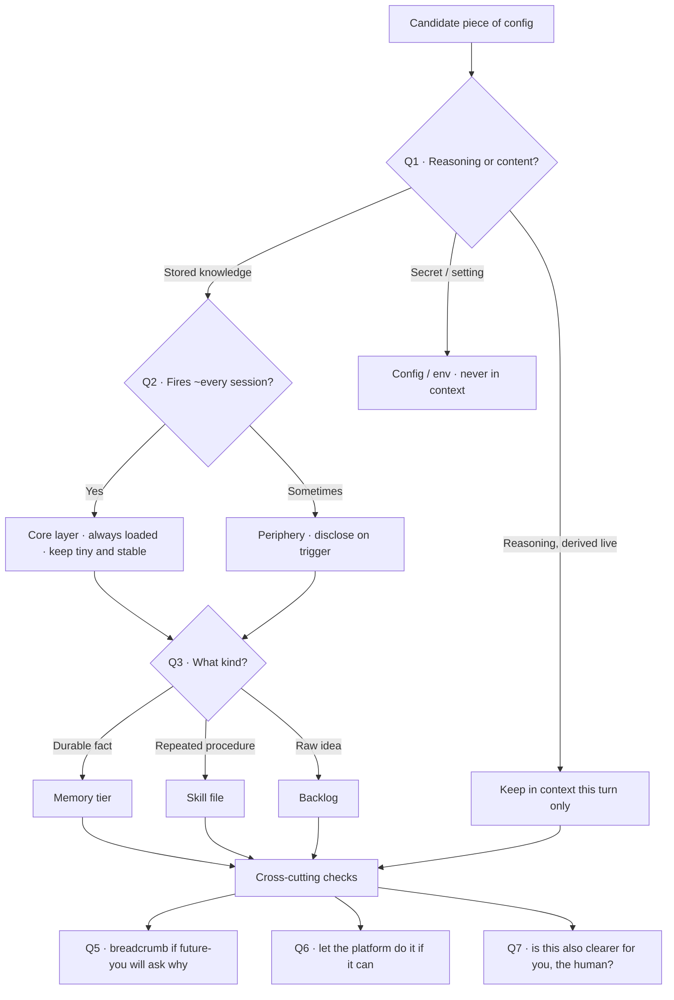

# The Placement Rule

> The original spine of this framework. One decision procedure; the eight
> principles are its branches. This is the part you'll actually reach for with a
> config file open.

---

## Why this exists

Most writing on context engineering is addressed to teams building agents *on a
platform*. This framework is addressed to a different person: the one
hand-writing the configuration of an open-source agent framework — Hermes,
OpenClaw, a custom harness — staring at a pile of YAML and JSON and asking a very
concrete question:

> *This piece of my agent — this fact, this rule, this procedure, this
> personality trait — where does it go, and when should it load?*

The attention-budget thesis (context is finite; find the smallest high-signal
set) tells you *why* the question matters. It does not tell you what to do with
the file open in front of you. The Placement Rule does.

## The rule

For any candidate piece of your agent's makeup, ask, in order:

1. **Reasoning or content?** If the model must *derive* it live, it belongs in
   context. If it's stored knowledge, externalize it.
2. **Always or sometimes?** Fires in nearly every session → core (small, stable).
   Fires only sometimes → periphery (disclosed on trigger, never preloaded).
3. **What kind of content?** A durable fact → a memory tier. A repeated procedure
   → a skill. A raw idea → the backlog. Don't mix the three.
4. **One agent, or many?** If the task splits into independent chunks, route it
   and hand off *distilled summaries*, not full context.
5. **Will future-you ask "why is this here"?** If yes, leave a breadcrumb now.
6. **Does the platform already do this?** If your harness ships compaction,
   file-memory, or a skills format, configure it — don't reimplement it.
7. **Remember the human.** Every externalization is also a thinking aid for *you*.

Questions 1–3 decide *placement*. Question 4 decides *execution*. Questions 5–7
are cross-cutting checks you apply to whatever you just placed.

## The decision flow

## Worked examples

Each row takes a real thing you'd be tempted to drop into a system prompt, and
walks it to its home.

**"The user lives in Romandie and works in French."**
Q1 content → Q2 fires every session (steers tone, locale) → Q3 durable fact →
**working memory, always injected.** It's small, high-signal, and reduces
steering every turn. *Principle: Externalized Memory.*

**"Always run the tests before declaring a task done."**
Q1 content → Q2 fires across nearly all coding work → it's a *reflex*, not a
procedure → **core identity, as a principle** ("verify before you claim").
Keep it one line. *Principle: Pointer Identity.*

**A 250-line procedure for parsing insurance PDFs.**
Q1 content → Q2 fires only on that one domain → Q3 repeated procedure →
**specialist skill, lazy-loaded on trigger.** Putting it in core would tax every
unrelated session. *Principles: Progressive Disclosure, Externalized Memory.*

**Your Tavily / Exa API keys.**
Q1 — neither reasoning nor content the model reasons over; it's a secret →
**config file / env var, never in context.** The agent calls the tool; it never
needs to see the key. *(Falls out of the flow at Q1.)*

**"We chose MoE routing over a single model because of cost at our volume."**
Q1 content → Q3 durable fact *with rationale* → memory → and Q5 fires hard:
future-you will absolutely ask why → **memory entry + a breadcrumb** (a commit
message or a dated decision note). *Principles: Externalized Memory, Ariadne's Thread.*

**A web-search result you need only for the task in front of you.**
Q1 content, but ephemeral → Q2 fires once → **stays in context this session,
archived to logs, not promoted.** Don't let one-off findings calcify into
"knowledge." *Principle: Context Recycling (what NOT to promote).*

**A 3-step deploy sequence you've now typed by hand four times.**
Q1 content → Q3 repeated procedure, past the threshold → **promote to a skill.**
The fourth manual repetition was the signal. *Principle: Context Recycling.*

**A research task that splits into five independent sub-questions.**
Q4 fires → **route to parallel workers**, each with a clean window, each
returning a ~1–2K-token summary — not their full transcripts. *Principles:
Orchestrated Routing, Dynamic Delegation.*

## Quick reference

| You have… | Default home | When it loads | Principle |
|-----------|--------------|---------------|-----------|
| A fact that steers most sessions | Working memory (core) | Every turn | Externalized Memory |
| A behavioral reflex | Identity / SOUL | Every turn | Pointer Identity |
| A domain procedure | Specialist skill | On trigger | Progressive Disclosure |
| A procedure used 3+ times | Promote to skill | On trigger | Context Recycling |
| A decision + its rationale | Memory + breadcrumb | On demand | Ariadne's Thread |
| A raw idea | Backlog | On review | Context Recycling |
| A secret / API key | Config / env | Never in context | — |
| A one-off result | Context, then archive | This session only | Context Recycling |
| Independent sub-tasks | Parallel workers | Per task | Dynamic Delegation |

When in doubt, the tie-breaker is the thesis itself: *if it isn't earning its
place in the attention budget this turn, it belongs somewhere else.*

## What is borrowed and what is ours

- **Borrowed (and credited):** the constraint itself — finite attention, "the
  smallest high-signal set." Transformer physics and cognitive science,
  documented by Anthropic and others. We claim none of it.
- **Ours:** turning that constraint into a *configuration decision discipline*
  for DIY framework users — the rule, the flow, the worked placements — and
  framing the system as a cognitive architecture that includes the human in the
  loop. Modest, but real, and absent from the platform-centric literature.
